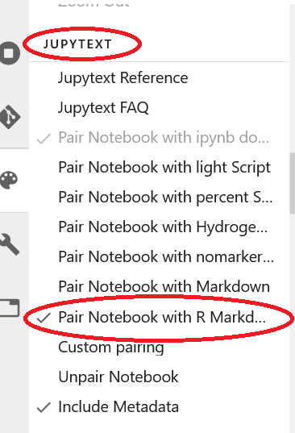

---
jupyter:
  jupytext:
    formats: ipynb,Rmd
    text_representation:
      extension: .Rmd
      format_name: rmarkdown
      format_version: '1.2'
      jupytext_version: 1.11.1
  kernelspec:
    display_name: Python [conda env:root] *
    language: python
    name: conda-root-py
---

<style>
    .instructions { color: red; }
</style>


# Conda Package Mangement for Genomics

## Introduction
Conda is cross-platform. Anaconda&mdash;the company that officially provides conda&mdash;provides a bloated metapackage called "Anaconda." Most people use a minimal installation called "Miniconda" as a starting point. 

* Conda makes installing software easy
* Conda handles all dependencies
* Conda insures packages compatible
* Conda packages are available for almost any software you want to install
* Conda isolates computing environments
* Conda allows tailored computing environments with specific compatible versions (e.g. Python 2 vs 3)
* Conda uses uses **cross-platform**, shareable, and reproducible environment specifications
* Conda cooperates with pip&mdash;it tracks which things you install with pip
* Conda can work with docker to spec out containers
* Conda can be slow resolving an installation recipe. An experimental alternative version of conda, `mamba`, is faster.
* Conda is becoming the _de-facto_ package management system in the datascience and bio-datascience worlds.

>Galaxy has adopted a new standard for tool dependencies: Condapackages!

>Not only do Condapackages make tool dependencies more reliable and stable, they are also easier to test and faster to develop than the traditional Tool Shed package recipes.

https://docs.galaxyproject.org/en/master/admin/conda_faq.html

## Conda vs. Anaconda
The Anaconda company developed conda to solve a problem with pip. At the time (I don't know if still the case) pip would install packages with incompatible dependencies.

Conda split off as an open source project. 

Anaconda uses conda and also supplies
* It's own curated set of conda recipes
* A meta-package that installs a whole suite of tools
* Graphical interface
* Other stuff no one really needs

## Conda Channels

### Proprietary vs. Open-Source
There are two main paths you can follow:

1. Anaconda channel plus R channel
    - `anaconda` channel managed by Anaconda
    - `R` channel which uses Microsoft's version of R
1. Open-Source channels
    - conda-forge
    - bioconda
    - defaults

**NOTE:** _DO NOT mix these two channel sources._

See:

https://github.com/conda/conda/issues/7684#issuecomment-415588307

and

https://github.com/conda/conda/issues/7684#issuecomment-415588307

### `.condarc` file
Conda looks for a `.condarc` file in you home directory, or failing that in the conda install directory, for channel priority. This is where you control which channels you use.

If you have a `.condarc` then you do not need to specify `conda install -c <channel> package`. Conda will look in the channels you have specified from top to bottom.

For genomics your `.condarc` should look like:
```
channels:
    - conda-forge
    - bioconda
    - defaults
```

You can also build the `.condarc` with commands:

```
conda config --add channels bioconda
conda config --add channels conda-forge
```

**NOTE:** _Each new channel is added to the top of the list._

## Conda makes installing software easy
### Installing conda
* Navigate to the [miniconda download site](https://docs.conda.io/en/latest/miniconda.html). Right-click-copy the link for Python 3.9, Linux x64.  
* Open a terminal in Jupyterlab   
* Type `wget https://repo.anaconda.com/miniconda/Miniconda3-py39_4.9.2-Linux-x86_64.sh`  
* Run `bash Miniconda3-py39_4.9.2-Linux-x86_64.sh`  
* Just answer yes to everything  
* If necessary, `source .bashrc`

### Google AI Notebooks
Conda is pre-loaded in Google AI Notebooks. But you should still set up a `.condarc`.

### Installing software with conda
A good starting point is:

`conda install ipykernel r-ggplot2 r-irkernel r-tidyverse r-ggplot2 nb_conda_kernels r-rmarkdown r-markdown pandas numpy scipy -y`

**NOTE:** _If you really want to jumpstart your R environment you can install the meta-package_ `r-essentials`.
 
You can also install a specific version with, for example, `conda install python=2.7`, but this would update ALL other packages to match that request. If there  are conflicts it will tell you. Unfortunately, it only tells you one package at a time. So you would need to serially remove those.

A better solution is to create a dedicated environment for specific versions such as Python 2. More later...

### Other things you can install
* Language agnostic: Python, R, C, C++, Java, etc.
* `samtools picard gatk bedtools bioconductor-monocle octopus`  
* All sorts of Bioconductor 
* Notice: Some Bioconductor packages require the prefix "bioconductor-", others do not. It just depends on how the recipe was written.
* You can find software (and versions) with `conda search <pkgname or part of>`. It's a bit slow. Often the better method is to just do a google search "conda \<pkg name\>"

## Conda Environments
* You can create isolated environments `conda env create -n <name>`
* Activate the environments with `conda activate <name>`
* You can install packages at the same time as you create:
`conda env create -n <name> <pkg1=v###> <pkg2=v###>...`

**Try it**
`conda create -n py27 python=2.7 pandas scipy numpy nb_conda_kernels`

**NOTE:** _You need to install_ `nb_conda_kernels` _to use the environment in JupyterLab._

## Conda Environments with Jupyter
* WARNING: The AI notebook environment uses conda
* Google has some of their own packages and uses custom source. You can see them if you run `conda list...`
* The kernel the notebook uses to run code does NOT have to be the same as the one the notebook itself is running in.
* So, create some named environments.
* Include the `nb_conda_kernels` package
* You will now be able to choose which environment you want to use within the notebook itself!
* I recommend creating a personal conda environment and adding `activate <myenv>` to your `.bashrc` file.


## Warning! Mixing and matching Conda and !Conda

```{python}
from IPython.display import YouTubeVideo

YouTubeVideo('Y3lQSxNdr3c', width=800, height=300)
```

## Bonus Section&mdash;RMarkdown in Jupyter
### Jupytext
You can run R in Jupyter notebooks by using an R kernel or with "magics."

But there is an extension called ["Jupytext"](https://jupytext.readthedocs.io/en/latest/install.html) that also allows you to save your notebooks simultaneously in Rmd and ipynb formats and also run Rmd notebooks in Jupyer.

The process isn't seamless, but if you have build an RMarkdown notebook locally, you can then also run it in Jupyter. 

### Installing Jupytext
```
conda install jupytext
```

Then restart the AI Notebook.

If Jupytext still isn't available, you can try
```
jupyter labextension install jupyterlab-jupytext@1.1.1  # for JupyterLab 1.x
```

**NOTE:** _AI Notebooks actually run a very old version of Jypter. Therefore you have to be careful about installing extensions. You need to use the command as shown which activates the version of Jupytext for older Jupyter._

### Using Jupytext
* With a Notebook active, click on the artist's palette symbol on the left.


* Then scroll down to the "JUPYTEXT" section. Click "Pair Notebook with R Markdown. You can also check "Include Metadata."



### Example
1. Open the "ggplot.ipynb" notebook
1. Run it
1. Scroll to JUPYTEXT secion and pair with R Markdown
1. Save the notebook
1. Look in the filemanager for "ggplot.Rmd"
1. Right-click on it and select "open in editor." You will see the RMD source code
1. Right-click and select "open in notebook." Now it is a notebook. Run it again.
1. You could now download the RMD and run it in RStudio. **NOTE:** You will probably want to add

```
---
...
...
...
output:
    html_notebook: default
...
...
...
---
```

    to the YAML preamble. If you are using `html_document` you should switch to `html_notebook`, for like a zillion reasons.

```{python}

```
